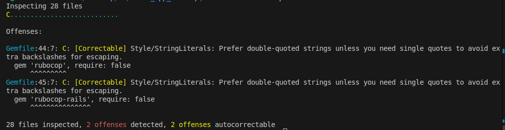

### Step 1: Create a New Rails Project

To create a new Rails project, run:

```sh
rails new my_rails_project
cd my_rails_project
```

## Step 2: Add RuboCop to the Project

Edit the `Gemfile` and add the following gems under the `development` and `test` groups:

```ruby
group :development, :test do
  gem 'rubocop', require: false
  gem 'rubocop-rails', require: false
end
```
## Step 2: Install the Gems 

Then install the gems:

```sh
bundle install

```

## Step 3: Configure RuboCop

Generate a default configuration file:

```ruby
bundle exec rubocop --auto-gen-config

```

This will create .rubocop_todo.yml, which lists existing offenses in your project.

To enable Rails-specific rules, add the following to .rubocop.yml:

require:
  - rubocop-rails

## Step 4: Run RuboCop

To check your code for style violations, run:

```ruby
bundle exec rubocop
```

 

To automatically fix issues, use:

```ruby
bundle exec rubocop -A
```
## Step 5: Ignoring Specific Files or Rules

To ignore certain files, add them to .rubocop.yml:

AllCops:
  Exclude:
    - 'db/**/*'
    - 'vendor/**/*'

To disable specific cops for a section of code:

# rubocop:disable Style/StringLiterals
puts "Hello, World!"
# rubocop:enable Style/StringLiterals

## Step 6: Running RuboCop in CI/CD

To integrate RuboCop into a CI/CD pipeline, add this step to your GitHub Actions or CI script:

- name: Run RuboCop
  run: bundle exec rubocop --parallel


